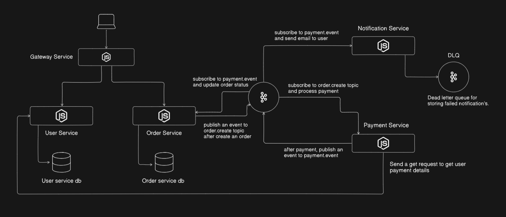

# payment-processing-microservices Architecture

## Tổng quan

Tệp README này cung cấp giải thích chi tiết về kiến trúc của một ứng dụng dựa trên microservices. Hệ thống bao gồm năm dịch vụ: **Gateway Service**, **User Service**, **Order Service**, **Payment Service**, và **Notification Service**.  
Các dịch vụ giao tiếp thông qua REST APIs, Kafka topics, và tuân theo kiến trúc hướng sự kiện để đảm bảo khả năng mở rộng và độ tin cậy.



## Mô tả dịch vụ

### 1. Gateway Service
- Reverse proxy định tuyến request đến User Service hoặc Order Service.

### 2. User Service
- Quản lý user (signup, signin).
- Lưu thông tin thanh toán.
- Cung cấp API cho Payment Service lấy payment details.

### 3. Order Service
- Tạo order trạng thái `"pending"`.
- Publish sự kiện `order.create`.
- Lắng nghe `payment.event` để cập nhật trạng thái đơn hàng.

### 4. Payment Service
- Subscribe `order.create` để xử lý thanh toán.
- Gọi User Service lấy payment details.
- Tích hợp với Stripe → publish `payment.event`.

### 5. Notification Service
- Subscribe `payment.event`.
- Gửi email thông báo.
- Sử dụng **DLQ** cho message thất bại.

### Message Broker (Kafka)
- **Topics**:
    - `order.create` (Order → Payment)
    - `payment.event` (Payment → Order + Notification)

---

## Công nghệ sử dụng
- **Node.js, Express**
- **Apache Kafka**
- **PostgreSQL**
- **Stripe**
- **Docker**

---

## Hướng dẫn chạy môi trường phát triển

### Docker cơ bản
- **Build 1 service**:
  ```bash
  docker compose build --no-cache user-service
  docker compose up -d user-service
  ```
- **Build toàn hệ thống**:
  ```bash
  docker compose up -d --build     # chạy ngầm
  docker compose up --build        # chạy có log
  ```

### Database Migration
- **Kiểm tra migration**:
  ```bash
  docker-compose exec user-service npx prisma migrate status
  ```
- **Development**:
  ```bash
  docker-compose exec user-service npx prisma migrate dev
  ```
- **Production**:
  ```bash
  docker-compose exec user-service npx prisma migrate deploy
  ```
- **Sinh lại Prisma Client nếu schema thay đổi**:
  ```bash
  docker-compose exec user-service npx prisma generate
  ```

### Kết nối và kiểm tra DB trực tiếp
```bash
docker exec -it user-db psql -U postgres -d foodfast_user
```

### Test nhanh bằng Postman
- **Signup**:
  ```json
  {
    "name": "Nguyen Van A",
    "email": "test@example.com",
    "password": "123456",
    "phone_number": "+84901234567"
  }
  ```
- **Signin**:
  ```json
  {
    "email": "test@example.com",
    "password": "123456"
  }
  ```

---

# SGU_CNPM_FOODFAST
